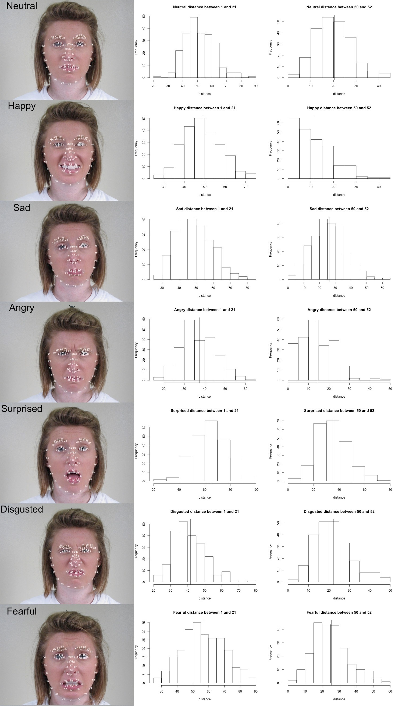

In your final repo, there should be an R markdown file that organizes **all computational steps** for evaluating your proposed Facial Expression Recognition framework. 

This file is currently a template for running evaluation experiments. You should update it according to your codes but following precisely the same structure. 

```{r message=FALSE, warning = FALSE, echo = FALSE}
if(!require("EBImage")){
  install.packages("BiocManager")
  BiocManager::install("EBImage")
}
if(!require("R.matlab")){
  install.packages("R.matlab")
}
if(!require("readxl")){
  install.packages("readxl")
}

if(!require("dplyr")){
  install.packages("dplyr")
}
if(!require("readxl")){
  install.packages("readxl")
}

if(!require("ggplot2")){
  install.packages("ggplot2")
}

if(!require("caret")){
  install.packages("caret")
}

if(!require("glmnet")){
  install.packages("glmnet")
}

if(!require("WeightedROC")){
  install.packages("WeightedROC")
}

if(!require("gbm")){
  install.packages("gbm")
}

if(!require("xgboost")){
  install.packages("xgboost")
}


library(R.matlab)
library(readxl)
library(dplyr)
library(EBImage)
library(ggplot2)
library(caret)
library(glmnet)
library(WeightedROC)

library(gbm)
library(xgboost)

# install other packages as needed using the format above 


```

### Step 0 set work directories
```{r wkdir, eval=FALSE}

set.seed(2020)
setwd("~/GitHub/Fall2020-Project3-group1/doc")


# change the working directory as needed
# if someone can make this a relative path, that would be great!!! 


```

Provide directories for training images. Training images and Training fiducial points will be in different subfolders.

```{r}
# change the directory of the data to where it's stored in your local drive as needed
# train_dir <- "../data/train_set/" # This will be modified for different data sets.


train_dir <- "~/train_set/" 

train_image_dir <- paste(train_dir, "images/", sep="")
train_pt_dir <- paste(train_dir,  "points/", sep="")
train_label_path <- paste(train_dir, "label.csv", sep="") 

```

### Step 1: set up controls for evaluation experiments.

In this chunk, we have a set of controls for the evaluation experiments. 

+ (T/F) cross-validation on the training set
+ (T/F) reweighting the samples for training set 
+ (number) K, the number of CV folds
+ (T/F) process features for training set
+ (T/F) run evaluation on an independent test set
+ (T/F) process features for test set

```{r exp_setup}
K <- 5  # number of CV folds

run.fudicial.list <- FALSE
run.feature.train <- FALSE # process features for training set
run.feature.test <- FALSE # process features for test set
sample.reweight <- TRUE # run sample reweighting in model training

run.cv.gbm <- FALSE # run cross-validation on the training set for gbm 
run.train.gbm <- FALSE # run evaluation on entire train set
run.test.gbm <- TRUE # run evaluation on an independent test set


# add controls here to make if else statements to either cross-validate, test, train, or to just load saved data
# for xgboost, we need to also train and test each time we knit to record the time for the model 


```

Using cross-validation or independent test set evaluation, we compare the performance of models with different specifications. In this Starter Code, we tune parameter lambda (the amount of shrinkage) for logistic regression with LASSO penalty.

```{r model_setup}
# hyperparameters for our models 

# gbm model (baseline)
hyper_grid_gbm <- expand.grid(
  shrinkage = c(0.001, 0.005, 0.010, 0.050, 0.100),
  n.trees = c(600, 1200, 1800)
)

# xgboost model 
hyper_grid_xgboost <- expand.grid(
  eta = c(0.01, 0.05, 0.1, 0.2, 0.3),
  lambda = c(0.001, 0.005, 0.010, 0.050, 0.100),
  gamma = c(0, 5),
  nrounds = c(100, 200, 600)
)


# add more hyperparameters for each model as needed 


```

### Step 2: import data and train-test split 
```{r}
#train-test split
info <- read.csv(train_label_path)
n <- nrow(info)
n_train <- round(n*(4/5), 0)
train_idx <- sample(info$Index, n_train, replace = F)
test_idx <- setdiff(info$Index, train_idx)
```


Fiducial points are stored in matlab format. In this step, we read them and store them in a list.
```{r read fiducial points}
n_files <- length(list.files(train_image_dir))

if (run.fudicial.list){
  #function to read fiducial points
  #input: index
  #output: matrix of fiducial points corresponding to the index
  readMat.matrix <- function(index){
       return(round(readMat(paste0(train_pt_dir, sprintf("%04d", index), ".mat"))[[1]],0))
  }
  
  #load fiducial points
  fiducial_pt_list <- lapply(1:n_files, readMat.matrix)
  save(fiducial_pt_list, file="../output/fiducial_pt_list.RData")
} else {
  load(file="../output/fiducial_pt_list.RData")
}
```

### Step 3: construct features and responses

+ The follow plots show how pairwise distance between fiducial points can work as feature for facial emotion recognition.

  + In the first column, 78 fiducials points of each emotion are marked in order. 
  + In the second column distributions of vertical distance between right pupil(1) and  right brow peak(21) are shown in  histograms. For example, the distance of an angry face tends to be shorter than that of a surprised face.
  + The third column is the distributions of vertical distances between right mouth corner(50)
and the midpoint of the upper lip(52).  For example, the distance of an happy face tends to be shorter than that of a sad face.



`feature.R` should be the wrapper for all your feature engineering functions and options. The function `feature( )` should have options that correspond to different scenarios for your project and produces an R object that contains features and responses that are required by all the models you are going to evaluate later. 
  
  + `feature.R`
  + Input: list of images or fiducial point
  + Output: an RData file that contains extracted features and corresponding responses

```{r feature}
source("../lib/feature.R")
tm_feature_train <- NA
if(run.feature.train){
  tm_feature_train <- system.time(dat_train <- feature(fiducial_pt_list, train_idx))
  save(dat_train, tm_feature_train, file="../output/feature_train.RData")
}else{
  load(file="../output/feature_train.RData")
}

tm_feature_test <- NA
if(run.feature.test){
  tm_feature_test <- system.time(dat_test <- feature(fiducial_pt_list, test_idx))
  save(dat_test, tm_feature_test, file="../output/feature_test.RData")
}else{
  load(file="../output/feature_test.RData")
}
```

\newpage

## Gradient Boosted Trees (gbm model) (Baseline Model)

### Step 4: Train a classification model with training features and responses
Call the train model and test model from library. 

`train.R` and `test.R` should be wrappers for all your model training steps and your classification/prediction steps. 

+ `train.R`
  + Input: a data frame containing features and labels and a parameter list.
  + Output:a trained model
+ `test.R`
  + Input: the fitted classification model using training data and processed features from testing images 
  + Input: an R object that contains a trained classifier.
  + Output: training model specification

+ In this Starter Code, we use logistic regression with LASSO penalty to do classification. 

```{r loadlib_gbm}
source("../lib/train_gbm.R") 
source("../lib/test_gbm.R")
```

#### Model selection with cross-validation
* Do model selection by choosing among different values of training model parameters.

```{r runcv_gbm, message = FALSE}
source("../lib/cross_validation_gbm.R")
feature_train = as.matrix(dat_train[, -6007])
label_train = as.integer(dat_train$label) 

if(run.cv.gbm){
  res_cv <- matrix(0, nrow = nrow(hyper_grid_gbm), ncol = 4)
  for(i in 1:nrow(hyper_grid_gbm)){
    cat("n.trees = ", hyper_grid_gbm$n.trees[i], ", 
        shrinkage = ", hyper_grid_gbm$shrinkage[i],"\n", sep = "")
    res_cv[i,] <- cv.function(features = feature_train, labels = label_train,
                              num_trees = hyper_grid_gbm$n.trees[i], 
                              shrink = hyper_grid_gbm$shrinkage[i], 
                              K, reweight = sample.reweight)
  save(res_cv, file="../output/res_cv_gbm.RData")
  }
}else{
  load("../output/res_cv_gbm.RData")
}
```

*Visualize cross-validation results. 
```{r cv_vis_gbm}
res_cv_gbm <- as.data.frame(res_cv) 
colnames(res_cv_gbm) <- c("mean_error", "sd_error", "mean_AUC", "sd_AUC")

gbm_cv_results = data.frame(hyper_grid_gbm, res_cv_gbm)

# Mean Error
ggplot(gbm_cv_results, aes(as.factor(shrinkage), as.factor(n.trees), fill = mean_error)) + 
  geom_tile()

# Mean AUC
ggplot(gbm_cv_results, aes(as.factor(shrinkage), as.factor(n.trees), fill = mean_AUC)) + 
  geom_tile()


# Mean Error
# N.Trees = 600
ggplot(gbm_cv_results[gbm_cv_results$n.trees == 600, ],
       aes(x = as.factor(shrinkage), y = mean_error, 
           ymin = mean_error - sd_error, ymax = mean_error + sd_error)) + 
    geom_crossbar() + theme(axis.text.x = element_text(angle = 90, hjust = 1))

# N.Trees = 1200
ggplot(gbm_cv_results[gbm_cv_results$n.trees == 1200, ],
       aes(x = as.factor(shrinkage), y = mean_error, 
           ymin = mean_error - sd_error, ymax = mean_error + sd_error)) + 
    geom_crossbar() + theme(axis.text.x = element_text(angle = 90, hjust = 1))

# N.Trees = 1800
ggplot(gbm_cv_results[gbm_cv_results$n.trees == 1800, ],
       aes(x = as.factor(shrinkage), y = mean_error, 
           ymin = mean_error - sd_error, ymax = mean_error + sd_error)) + 
    geom_crossbar() + theme(axis.text.x = element_text(angle = 90, hjust = 1))


# Mean AUC
# N.Trees = 600
ggplot(gbm_cv_results[gbm_cv_results$n.trees == 600, ],
       aes(x = as.factor(shrinkage), y = mean_AUC, 
           ymin = mean_AUC - sd_AUC, ymax = mean_AUC + sd_AUC)) + 
    geom_crossbar() + theme(axis.text.x = element_text(angle = 90, hjust = 1))

# N.Trees = 1200
ggplot(gbm_cv_results[gbm_cv_results$n.trees == 1200, ],
       aes(x = as.factor(shrinkage), y = mean_AUC, 
           ymin = mean_AUC - sd_AUC, ymax = mean_AUC + sd_AUC)) + 
    geom_crossbar() + theme(axis.text.x = element_text(angle = 90, hjust = 1))

# N.Trees = 1800
ggplot(gbm_cv_results[gbm_cv_results$n.trees == 1800, ],
       aes(x = as.factor(shrinkage), y = mean_AUC, 
           ymin = mean_AUC - sd_AUC, ymax = mean_AUC + sd_AUC)) + 
    geom_crossbar() + theme(axis.text.x = element_text(angle = 90, hjust = 1))
```


* Choose the "best" parameter value

```{r best_model_gbm}
par_best_gbm_ind <- which(gbm_cv_results$mean_AUC == max(gbm_cv_results$mean_AUC))
par_best_gbm_shrinkage <- gbm_cv_results$shrinkage[par_best_gbm_ind]
par_best_gbm_n.trees <- gbm_cv_results$n.trees[par_best_gbm_ind]
```

* Train the model with the entire training set using the selected model (model parameter) via cross-validation.

```{r final_train_gbm}
if (run.train.gbm) {
  # training weights
  weight_train <- rep(NA, length(label_train))
  for (v in unique(label_train)){
    weight_train[label_train == v] = 0.5 * length(label_train) / length(label_train[label_train == v])
  }
  
  if (sample.reweight){
    tm_train_gbm <- system.time(fit_train_gbm <- train(feature_train, label_train, w = weight_train, 
                                                       num_trees = par_best_gbm_n.trees, 
                                                       shrink = par_best_gbm_shrinkage))
  } else {
    tm_train_gbm <- system.time(fit_train_gbm <- train(feature_train, label_train, w = NULL, 
                                                       num_trees = par_best_gbm_n.trees,
                                                       shrink = par_best_gbm_shrinkage))
  }
  save(fit_train_gbm, tm_train_gbm, file="../output/fit_train_gbm.RData")
  
} else {
  load(file="../output/fit_train_gbm.RData")
}
```

### Step 5: Run test on test images

```{r test_gbm, message = FALSE}
tm_test_gbm = NA
feature_test <- as.matrix(dat_test[, -6007])
label_test <- as.integer(dat_test$label)

if(run.test.gbm){
  load(file="../output/fit_train_gbm.RData")
  tm_test_gbm <- system.time({prob_pred <- test(fit_train_gbm, feature_test, pred.type = 'response'); 
                              label_pred <- ifelse(prob_pred >= 0.5, 1, 0)})
}
```

* Evaluation
```{r, message = FALSE}
## reweight the test data to represent a balanced label distribution

weight_test <- rep(NA, length(label_test))
for (v in unique(label_test)){
  weight_test[label_test == v] = 0.5 * length(label_test) / length(label_test[label_test == v])
}

# convert the original 1-2 class into numeric 0s and 1s
label_test <- ifelse(label_test == 2, 0, 1)

accu <- sum(weight_test * (label_pred == label_test)) / sum(weight_test)
tpr.fpr <- WeightedROC(prob_pred, label_test, weight_test)
auc <- WeightedAUC(tpr.fpr)
```

```{r, echo = FALSE}
cat("The accuracy of the gbm model (", "shinkage = ", par_best_gbm_shrinkage, ", n.trees = ", par_best_gbm_n.trees, ") is ", accu*100, "%.\n", sep = "")
cat("The AUC of the gbm model (", "shinkage = ", par_best_gbm_shrinkage, ", n.trees = ", par_best_gbm_n.trees, ") is ", auc, ".\n", sep = "")
```


#### Summarize Running Time

Prediction performance matters, so does the running times for constructing features and for training the model, especially when the computation resource is limited. 


```{r running_time_gbm, echo = FALSE}
cat("Time for constructing training features = ", tm_feature_train[1], " seconds \n", sep = "")
cat("Time for constructing testing features = ", tm_feature_test[1], " seconds \n", sep = "")

cat("Time for training gbm model = ", tm_train_gbm[1], " seconds \n", sep = "") 
cat("Time for testing gbm model = ", tm_test_gbm[1], " seconds \n" , sep = "")
```


\newpage


## xgboost Model (Proposed Model) 

### Step 4: Train a classification model with training features and responses
Call the train model and test model from library. 

`train.R` and `test.R` should be wrappers for all your model training steps and your classification/prediction steps. 

+ `train.R`
  + Input: a data frame containing features and labels and a parameter list.
  + Output:a trained model
+ `test.R`
  + Input: the fitted classification model using training data and processed features from testing images 
  + Input: an R object that contains a trained classifier.
  + Output: training model specification

+ In this Starter Code, we use logistic regression with LASSO penalty to do classification. 

```{r loadlib_xgboost}

```

#### Model selection with cross-validation
* Do model selection by choosing among different values of training model parameters.

```{r runcv_xgboost}

```

*Visualize cross-validation results. 
```{r cv_vis_xgboost}

```

* Choose the "best" parameter value

```{r best_model_xgboost}

```

* Train the model with the entire training set using the selected model (model parameter) via cross-validation.

```{r final_train_xgboost}

```

### Step 5: Run test on test images

```{r}

```

* Evaluation

```{r}

```


```{r, echo = FALSE}

```

#### Summarize Running Time

Prediction performance matters, so does the running times for constructing features and for training the model, especially when the computation resource is limited. 

```{r running_time_xgboost, echo = FALSE}

```


\newpage

## Other Models 

## Principal Components Analysis (PCA) + Support Vector Machines (SVMs)

### Step 4: Train a classification model with training features and responses
Call the train model and test model from library. 

`train.R` and `test.R` should be wrappers for all your model training steps and your classification/prediction steps. 

+ `train.R`
  + Input: a data frame containing features and labels and a parameter list.
  + Output:a trained model
+ `test.R`
  + Input: the fitted classification model using training data and processed features from testing images 
  + Input: an R object that contains a trained classifier.
  + Output: training model specification

+ In this Starter Code, we use logistic regression with LASSO penalty to do classification. 

```{r loadlib_pca_svm}

```

#### Model selection with cross-validation
* Do model selection by choosing among different values of training model parameters.

```{r runcv_pca_svm}

```

*Visualize cross-validation results. 
```{r cv_vis_pcasvm}

```

* Choose the "best" parameter value

```{r best_model_pcasvm}

```

* Train the model with the entire training set using the selected model (model parameter) via cross-validation.

```{r final_train_pcasvm}

```

### Step 5: Run test on test images

```{r}

```

* Evaluation

```{r}

```


```{r, echo = FALSE}

```

#### Summarize Running Time

Prediction performance matters, so does the running times for constructing features and for training the model, especially when the computation resource is limited. 

```{r running_time_pcasvm, echo = FALSE}

```

\newpage

## Convolutional Neurual Networks 

### Step 4: Train a classification model with training features and responses
Call the train model and test model from library. 

`train.R` and `test.R` should be wrappers for all your model training steps and your classification/prediction steps. 

+ `train.R`
  + Input: a data frame containing features and labels and a parameter list.
  + Output:a trained model
+ `test.R`
  + Input: the fitted classification model using training data and processed features from testing images 
  + Input: an R object that contains a trained classifier.
  + Output: training model specification

+ In this Starter Code, we use logistic regression with LASSO penalty to do classification. 

```{r loadlib_cnn}

```

#### Model selection with cross-validation
* Do model selection by choosing among different values of training model parameters.

```{r runcv_cnn}

```

*Visualize cross-validation results. 
```{r cv_vis_cnn}

```

* Choose the "best" parameter value

```{r best_model_cnn}

```

* Train the model with the entire training set using the selected model (model parameter) via cross-validation.

```{r final_train_cnn}

```

### Step 5: Run test on test images

```{r}

```

* Evaluation

```{r}

```


```{r, echo = FALSE}

```

#### Summarize Running Time

Prediction performance matters, so does the running times for constructing features and for training the model, especially when the computation resource is limited. 

```{r running_time_cnn, echo = FALSE}

```

\newpage

## Random Forests

### Step 4: Train a classification model with training features and responses
Call the train model and test model from library. 

`train.R` and `test.R` should be wrappers for all your model training steps and your classification/prediction steps. 

+ `train.R`
  + Input: a data frame containing features and labels and a parameter list.
  + Output:a trained model
+ `test.R`
  + Input: the fitted classification model using training data and processed features from testing images 
  + Input: an R object that contains a trained classifier.
  + Output: training model specification

+ In this Starter Code, we use logistic regression with LASSO penalty to do classification. 

```{r loadlib_rf}

```

#### Model selection with cross-validation
* Do model selection by choosing among different values of training model parameters.

```{r runcv_rf}

```

*Visualize cross-validation results. 
```{r cv_vis_rf}

```

* Choose the "best" parameter value

```{r best_model_rf}

```

* Train the model with the entire training set using the selected model (model parameter) via cross-validation.

```{r final_train_rf}

```

### Step 5: Run test on test images

```{r}

```

#### Evaluation

```{r}

```


```{r, echo = FALSE}

```

#### Summarize Running Time

Prediction performance matters, so does the running times for constructing features and for training the model, especially when the computation resource is limited. 

```{r running_time_rf, echo = FALSE}

```

\newpage

## Reference(s)
- Du, S., Tao, Y., & Martinez, A. M. (2014). Compound facial expressions of emotion. Proceedings of the National Academy of Sciences, 111(15), E1454-E1462.


