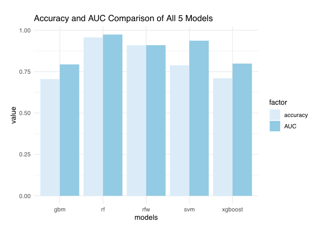

# Introduction

In this project, we created a classification engine for facial emotion recognition. Our group tried out four typical machine learning algorithms, trained them on the given data set, cross-validated to find the optimized parameters, and provided fair evaluation for all four of them. The evaluation process considered the mean error (and accuracy), the area under the ROC curve (or AUC), and running time (testing and training) to give a thorough comparison of the four methods. 

# Models Introduction

+ gbm model (baseline)

The baseline model gradient boosting is an ensemble method that uses a combination of weak learners--in this case, decision stumps--to predict classes. In each iteration of model training, the algorithm focuses on areas that the weak learners fail to properly classify and, using class weights, will focus on precisely these areas in the next iteration. This learning is done via gradient descent. 

+ xgboost model (proposed)

Extreme gradient boosting is a much faster version of the original gradient boosting model and uses methods faster than gradient descent, such as stochastic gradient descent in order to learn much quicker. 

+ PCA plus SVM model

Since the featured train data has a rather high dimension, we try PCA for data reduction as the first step. In this step we calculate all the principle components and cross validate the principle component number that gives the highest accuracy. Then we use SVM as the model since it performs well on two-group classification. 

+ random forest model

We try this model since random forest model is know for its high performance and powerfulness.

+ random forest with weights model 

Considering that the featured training set is highly-unbalanced, we try random forest model with weights as well.

# Results





# Analysis

```{r message=FALSE, warning = FALSE, echo = FALSE, tidy=TRUE, tidy.opts=list(width.cutoff=60)}
packages.used <- c("R.matlab","readxl", "dplyr", "EBImage", "ggplot2", "caret", "glmnet", "WeightedROC","pROC","gbm","xgboost","randomForest","ranger", "magrittr", "e1071","grid","gridExtra")

# check packages that need to be installed.
packages.needed <- setdiff(packages.used, intersect(installed.packages()[,1], packages.used))

# install additional packages
if(length(packages.needed) > 0){
   install.packages(packages.needed, dependencies = TRUE)
}

library(R.matlab)
library(readxl)
library(dplyr)
library(EBImage)
library(ggplot2)
library(caret)
library(glmnet)
library(WeightedROC)
library(pROC)
library(gbm)
library(xgboost)
library(randomForest)
library(ranger)
library(magrittr)   
library(e1071)
library(grid)
library(gridExtra)

```

### Step 0 set work directories
```{r wkdir, eval=FALSE}
set.seed(2020)
# setwd("~/GitHub/Fall2020-Project3-group1/doc") #change the working directory as needed
```

Provide directories for training images. Training images and Training fiducial points will be in different subfolders.

```{r train_dir}
train_dir <- "../data/train_set/" #may need to be changed to local directory

train_image_dir <- paste(train_dir, "images/", sep="")
train_pt_dir <- paste(train_dir,  "points/", sep="")
train_label_path <- paste(train_dir, "label.csv", sep="") 
```

### Step 1: set up controls for evaluation experiments.

In this chunk, we have a set of controls for the evaluation experiments. 

+ (T/F) cross-validation on the training set
+ (T/F) reweighting the samples for training set 
+ (number) K, the number of CV folds
+ (T/F) process features for training set
+ (T/F) run evaluation on an independent test set
+ (T/F) process features for test set

```{r exp_setup}
K <- 5  # number of CV folds

run.fudicial.list <- FALSE
run.feature.train <- FALSE # process features for training set
run.feature.test <- FALSE # process features for test set
sample.reweight <- TRUE # run sample reweighting in model training

run.cv.gbm <- FALSE # run cross-validation on the training set for gbm 
run.train.gbm <- FALSE # run evaluation on entire train set
run.test.gbm <- TRUE # run evaluation on an independent test set

run.cv.xgboost <- FALSE # run cross-validation on the training set for xgboost 
run.train.xgboost <- FALSE # run evaluation on entire train set
run.test.xgboost <- TRUE # run evaluation on an independent test set

run.cv.rforestw <- FALSE # run cross-validation on the training set for xgboost 
run.train.rforestw <- FALSE # run evaluation on entire train set
run.test.rforestw <- TRUE # run evaluation on an independent test set

run.cv.RF <- FALSE # run cross-validation on the training set for xgboost 
run.train.RF <- FALSE # run evaluation on entire train set
run.test.RF <- TRUE # run evaluation on an independent test set

run.cv.svm <- FALSE # run cross-validation on the training set for svm
run.train.svm <- FALSE # run evaluation on entire train set
run.test.svm <- TRUE # run evaluation on an independent test set
run.cv.pca <-FALSE # calculate pca
```

Using cross-validation or independent test set evaluation, we compare the performance of models with different specifications. 

In this chunk, we set up the hyperparameters used for our models.

```{r model_setup}
# gbm model (baseline)
hyper_grid_gbm <- expand.grid(
  shrinkage = c(0.001, 0.005, 0.010, 0.050, 0.100),
  n.trees = c(600, 1200, 1800)
)

# xgboost model 
hyper_grid_xgboost <- expand.grid(
  eta = c(0.01, 0.05, 0.1, 0.2, 0.3),
  lambda = c(0.001, 0.005, 0.010, 0.050, 0.100),
  gamma = c(0, 5),
  nrounds = c(600, 1200, 1800)
)

# svm model
hyper_grid_svm <- expand.grid(
  nprinciple = c(400, 450, 500, 550, 600, 650, 700, 750)
)

# random forest model
hyper_grid_rf_uw <- expand.grid(
  ntrees = c(100, 300, 500, 800, 1000),
  mtry = c(500)
)

# random forest with weights model 
hyper_grid_rforest <- expand.grid(
  ntrees = c(100, 300, 500, 800, 1000),
  maxd = c(0, 5, 10, 15, 20, 25)
)
```

### Step 2: import data and train-test split 
```{r train-test split}
info <- read.csv(train_label_path)
n <- nrow(info)
n_train <- round(n*(4/5), 0)
train_idx <- sample(info$Index, n_train, replace = F)
test_idx <- setdiff(info$Index, train_idx)
```


Fiducial points are stored in matlab format. In this step, we read them and store them in a list.
```{r read fiducial points}
n_files <- length(list.files(train_image_dir))

if (run.fudicial.list){
  readMat.matrix <- function(index){
       return(round(readMat(paste0(train_pt_dir, sprintf("%04d", index), ".mat"))[[1]],0))
  }
  
  fiducial_pt_list <- lapply(1:n_files, readMat.matrix)
  save(fiducial_pt_list, file="../output/fiducial_pt_list.RData")
  
  # otherwise load the data stored for convenience
} else {
  load(file="../output/fiducial_pt_list.RData")
}
```

### Step 3: construct features and responses

`feature.R` is the wrapper for all our feature engineering functions and options. The function `feature( )`  have options that correspond to different scenarios for our project and produces an R object that contains features and responses that are required by all the models we are going to evaluate later. 
  
  + `feature.R`
  + Input: list of images or fiducial point
  + Output: an RData file that contains extracted features and corresponding responses

```{r feature}
source("../lib/feature.R")
tm_feature_train <- NA
if(run.feature.train){
  tm_feature_train <- system.time(dat_train <- feature(fiducial_pt_list, train_idx))
  save(dat_train, tm_feature_train, file="../output/feature_train.RData")
}else{
  load(file="../output/feature_train.RData")
}

tm_feature_test <- NA
if(run.feature.test){
  tm_feature_test <- system.time(dat_test <- feature(fiducial_pt_list, test_idx))
  save(dat_test, tm_feature_test, file="../output/feature_test.RData")
}else{
  load(file="../output/feature_test.RData")
}
```

## Gradient Boosted Trees (gbm model) (Baseline Model)

### Step 4: Train a classification model with training features and responses

Call the train_gbm model and test_gbm model from library. 

`train_gbm.R` and `test_gbm.R` are wrappers for all our gbm model training steps and classification/prediction steps. 

+ `train_gbm.R`
  + Input: a data frame containing features and labels and a parameter list.
  + Output:a trained model
+ `test_gbm.R`
  + Input: the fitted classification model using training data and processed features from testing images 
  + Input: an R object that contains a trained classifier.
  + Output: training model specification

Since other train and test documents have the same structure as the gbm model, we will omit them.

```{r loadlib_gbm, echo=FALSE}
source("../lib/train_gbm.R") 
source("../lib/test_gbm.R")
source("../lib/cross_validation_gbm.R")
```

#### Model selection with cross-validation

* Do model selection by choosing among different values of training model parameters

Here we cross-validate parameters shrinkage and number of trees.

+ n.trees: the number of trees (or decision stumps) used in the model
+ shrinkage: the learning rate

The model also uses several parameters that can be cross-validated, such as "interaction.depth" and "distribution" were set to fit the needs of this situation. For example, "interaction.depth" was set to 1 since our focus was to use decision trees and "distribution" was set to "binomial" since there are only two classes.  

We cross-validated three different values of "shrinkage" and three different values of "n.trees" for a total of 15 models cross-validated. We choose to test various slower learning rates--that is, none greater than 0.1, and we chose to consider 600, 1200, and 1800 decision stumps, as it could build a model based on approximately 10%, 20%, or 30%, respectively of the 6006 fiducial features. 

```{r runcv_gbm, message = FALSE}
feature_train = as.matrix(dat_train[, -6007])
label_train = as.integer(dat_train$label) 

if(run.cv.gbm){
  res_cv <- matrix(0, nrow = nrow(hyper_grid_gbm), ncol = 4)
  for(i in 1:nrow(hyper_grid_gbm)){
    cat("n.trees = ", hyper_grid_gbm$n.trees[i], ", 
        shrinkage = ", hyper_grid_gbm$shrinkage[i],"\n", sep = "")
    res_cv[i,] <- cv.function(features = feature_train, labels = label_train,
                              num_trees = hyper_grid_gbm$n.trees[i], 
                              shrink = hyper_grid_gbm$shrinkage[i], 
                              K, reweight = sample.reweight)
  save(res_cv, file="../output/res_cv_gbm.RData")
  }
}else{
  load("../output/res_cv_gbm.RData")
}
```

And the first 5 optimized parameters among the all 15 models we got are:

(see the appendix for full table)

```{r optimized_parameter_gbm, echo=FALSE}
res_cv_gbm <- as.data.frame(res_cv) 
colnames(res_cv_gbm) <- c("mean_error", "sd_error", "mean_AUC", "sd_AUC")

gbm_cv_results = data.frame(hyper_grid_gbm, res_cv_gbm)
gbm_cv_results[order(gbm_cv_results$mean_AUC, decreasing = TRUE), ][1:5, ]
```

* Visualize cross-validation results

```{r cv_vis_gbm_1,out.width = "65%",fig.align = 'center', echo=FALSE}
# Mean Error
p1 = ggplot(
  gbm_cv_results, aes(as.factor(shrinkage), as.factor(n.trees), fill = mean_error)) +
  geom_tile()+
  labs(title="Mean Error Heatmap for gbm", y="ntrees", x="shrinkage")

# Mean AUC
p2 = ggplot(
  gbm_cv_results, aes(as.factor(shrinkage), as.factor(n.trees), fill = mean_AUC)) + 
  geom_tile()+
  labs(title="Mean AUC Heatmap for gbm",  y="ntrees", x="shrinkage")

grid.arrange(p1, p2,nrow=2)
```

We could also see here that the set of parameters which will give us the smallest mean error is shrinkage = 0.05 and ntrees = 600 and that the set of parameters  which will give us the biggest mean AUC is shrinkage = 0.05 and ntrees = 1200.

```{r cv_vis_gbm_2, out.width = "65%",fig.align = 'center',echo=FALSE}
# Mean Error
# N.Trees = 600
p1 <- ggplot(gbm_cv_results[gbm_cv_results$n.trees == 600, ],
             aes(x = as.factor(shrinkage), y = mean_error, 
                 ymin = mean_error - sd_error, ymax = mean_error + sd_error)) + 
  geom_crossbar() + theme(axis.text.x = element_text(angle = 90, hjust = 1))+
  labs(title="Mean Error for gbm", subtitle="N.trees 600", 
       y="mean error", x="shrinkage")

# N.Trees = 1200
p2 = ggplot(gbm_cv_results[gbm_cv_results$n.trees == 1200, ],
            aes(x = as.factor(shrinkage), y = mean_error, 
                ymin = mean_error - sd_error, ymax = mean_error + sd_error)) + 
  geom_crossbar() + theme(axis.text.x = element_text(angle = 90, hjust = 1))+
  labs(title="Mean Error for gbm", subtitle="N.trees 1200", 
       y="mean error", x="shrinkage")

# N.Trees = 1800
p3 = ggplot(gbm_cv_results[gbm_cv_results$n.trees == 1800, ],
            aes(x = as.factor(shrinkage), y = mean_error, 
                ymin = mean_error - sd_error, ymax = mean_error + sd_error)) + 
  geom_crossbar() + theme(axis.text.x = element_text(angle = 90, hjust = 1))+
  labs(title="Mean Error for gbm", subtitle="N.trees 1800", 
       y="mean error", x="shrinkage")

# Mean AUC
# N.Trees = 600
p4 = ggplot(gbm_cv_results[gbm_cv_results$n.trees == 600, ],
            aes(x = as.factor(shrinkage), y = mean_AUC, 
                ymin = mean_AUC - sd_AUC, ymax = mean_AUC + sd_AUC)) + 
  geom_crossbar() + theme(axis.text.x = element_text(angle = 90, hjust = 1))+
  labs(title="Mean AUC for gbm", subtitle="N.trees 600", 
       y="mean AUC", x="shrinkage")

# N.Trees = 1200
p5 = ggplot(gbm_cv_results[gbm_cv_results$n.trees == 1200, ],
            aes(x = as.factor(shrinkage), y = mean_AUC, 
                ymin = mean_AUC - sd_AUC, ymax = mean_AUC + sd_AUC)) + 
  geom_crossbar() + theme(axis.text.x = element_text(angle = 90, hjust = 1))+
  labs(title="Mean AUC for gbm", subtitle="N.trees 1200", 
       y="mean AUC", x="shrinkage")

# N.Trees = 1800
p6 = ggplot(gbm_cv_results[gbm_cv_results$n.trees == 1800, ],
            aes(x = as.factor(shrinkage), y = mean_AUC, 
                ymin = mean_AUC - sd_AUC, ymax = mean_AUC + sd_AUC)) + 
  geom_crossbar() + theme(axis.text.x = element_text(angle = 90, hjust = 1))+
  labs(title="Mean AUC for gbm", subtitle="N.trees 1800", 
       y="mean AUC", x="shrinkage")

grid.arrange(p1, p2, p3,p4,p5,p6,ncol = 3,nrow=2)

```

We could see in the plots the detailed performance of each set of parameters.

* Choose the "best" parameter value

Due to the presence imbalanced data, we choose to focus out attention on highest mean AUC rather than lowest mean error. However, we notice that the second best model (model 4) has an mean AUC comparable to that of the best model (model 9) while being much simpler--model 4 has 600 trees while model 9 has 1200--we choose to select the more parsimonious model as our best baseline gbm model. 

```{r best_model_gbm}
gbm_cv_results[order(gbm_cv_results$mean_AUC, decreasing = TRUE), ][2, ]
par_best_gbm_ind <- 4
par_best_gbm_shrinkage <- gbm_cv_results$shrinkage[par_best_gbm_ind]
par_best_gbm_n.trees <- gbm_cv_results$n.trees[par_best_gbm_ind]
```

* Train the model with the entire training set using the selected model (model parameter) via cross-validation.

```{r final_train_gbm}
if (run.train.gbm) {
  # training weights
  weight_train <- rep(NA, length(label_train))
  for (v in unique(label_train)){
    weight_train[label_train == v] = 0.5 * length(label_train) / 
      length(label_train[label_train == v])
  }
  
  if (sample.reweight){
    tm_train_gbm <- system.time(fit_train_gbm 
                                <- train(feature_train, label_train, w = weight_train, 
                                         num_trees = par_best_gbm_n.trees, 
                                         shrink = par_best_gbm_shrinkage))
  } else {
    tm_train_gbm <- system.time(fit_train_gbm 
                                <- train(feature_train, label_train, w = NULL, 
                                         num_trees = par_best_gbm_n.trees,
                                         shrink = par_best_gbm_shrinkage))
  }
  save(fit_train_gbm, tm_train_gbm, file="../output/fit_train_gbm.RData")
  
} else {
  load(file="../output/fit_train_gbm.RData")
}
```

### Step 5: Run test on test images

```{r test_gbm, message = FALSE}
tm_test_gbm = NA
feature_test <- as.matrix(dat_test[, -6007])
label_test <- as.integer(dat_test$label)

if(run.test.gbm){
  load(file="../output/fit_train_gbm.RData")
  tm_test_gbm <- system.time(
    {prob_pred <- test(fit_train_gbm, feature_test, pred.type = 'response'); 
                              label_pred <- ifelse(prob_pred >= 0.5, 1, 0)})
}
```

#### Evaluation

```{r evaluation_gbm, message = FALSE}
## reweight the test data to represent a balanced label distribution
weight_test <- rep(NA, length(label_test))
for (v in unique(label_test)){
  weight_test[label_test == v] = 
    0.5 * length(label_test) / length(label_test[label_test == v])
}

# convert the original 1-2 class into numeric 0s and 1s
label_test <- ifelse(label_test == 2, 0, 1)

accu_gbm <- sum(weight_test * (label_pred == label_test)) / sum(weight_test)
tpr.fpr <- WeightedROC(prob_pred, label_test, weight_test)
auc_gbm<- WeightedAUC(tpr.fpr)
```

```{r result_gbm, echo = FALSE}
cat("The accuracy of the gbm model (", 
    "shinkage = ", par_best_gbm_shrinkage, ", n.trees = ", 
    par_best_gbm_n.trees, ") is ", accu_gbm*100, "%.\n", sep = "")
cat("The AUC of the gbm model (", 
    "shinkage = ", par_best_gbm_shrinkage, ", n.trees = ", 
    par_best_gbm_n.trees, ") is ", auc_gbm, ".\n", sep = "")
```


#### Summarize Running Time

Prediction performance matters, so does the running times for constructing features and for training the model, especially when the computation resource is limited. 

```{r running_time_gbm, echo = FALSE}
cat("Time for constructing training features = ", tm_feature_train[1], " seconds \n", sep = "")
cat("Time for constructing testing features = ", tm_feature_test[1], " seconds \n", sep = "")

cat("Time for training gbm model = ", tm_train_gbm[1], " seconds \n", sep = "") 
cat("Time for testing gbm model = ", tm_test_gbm[1], " seconds \n" , sep = "")
```

## xgboost Model (Proposed Model) 

### Step 4: Train a classification model with training features and responses

Call the train_xgboost model and test_xgboost model from library. 

```{r loadlib_xgboost, echo=FALSE}
source("../lib/train_xgboost.R") 
source("../lib/test_xgboost.R") 
source("../lib/cross_validation_xgboost.R") 
```

#### Model selection with cross-validation
* Do model selection by choosing among different values of training model parameters.

Here we cross-validate parameters eta, lambda, gamma and nrounds.

+ nrounds: similar to the gbm model’s "n.trees" parameter, which we again cross-validated the values 600, 1200, and 1800. 

+ eta: the learning rate, similar to the gbm model’s "shrinkage" parameter. The default value is 0.3, so we cross-validate five values leading up to and including 0.3. 

+ gamma: allows the algorithm to decide whether to split on a certain part of the tree--the default value is 0, and other oft-used numbers include 1 and 5. Here, we choose to cross-validate with values 0 and 5.

+ lambda: a regularization term for the weights. We use values ranging from 0.01 to 0.1. 

The "max_depth" parameter and have been set to 1 and the "objective" parameter was set to "binary:logistic" in order for us to compare equally with the gbm model. 

In total, we have cross-validated 150 different xgboost models. 

```{r runcv_xgboost}
feature_train = as.matrix(dat_train[, -6007])
label_train = as.integer(dat_train$label) 

if(run.cv.xgboost){
  res_cv <- matrix(0, nrow = nrow(hyper_grid_xgboost), ncol = 4)
  for (i in 1:nrow(hyper_grid_xgboost)){
    print(i)
    res_cv[i,] <- cv.function(features = feature_train, labels = label_train,
                              K,
                              eta_val = hyper_grid_xgboost$eta[i], 
                              lmd = hyper_grid_xgboost$lambda[i], 
                              gam = hyper_grid_xgboost$gamma[i], 
                              nr = hyper_grid_xgboost$nrounds[i])
  save(res_cv, file="../output/res_cv_xgboost.RData")
  }
}else{
  load("../output/res_cv_xgboost.RData")
}
```

And the first 5 optimized parameters among the all 150 models we got are:

(see the appendix for full table)

```{r optimized_parameter_xgboost, echo=FALSE}
res_cv_xgboost <- as.data.frame(res_cv) 
colnames(res_cv_xgboost) <- c("mean_error", "sd_error", "mean_AUC", "sd_AUC")

res_cv_xgboost_cv_results = data.frame(hyper_grid_xgboost, res_cv_xgboost)
res_cv_xgboost_cv_results[order(
  res_cv_xgboost_cv_results$mean_AUC, decreasing = TRUE), ][1:5, ]
```

* Visualize cross-validation results.

```{r cv_vis_xgboost_1,out.width = "65%", fig.align = 'center',echo=FALSE}
# Mean Error
# gamma = 0, lambda = 0.05
p1 = ggplot(
  res_cv_xgboost_cv_results[res_cv_xgboost_cv_results$gamma == 0 & 
                              res_cv_xgboost_cv_results$lambda == 0.05, ], 
  aes(as.factor(nrounds), as.factor(eta), fill = mean_error)) +
  geom_tile()+
  labs(title="Mean Error Heatmap for xgboost", 
       subtitle="gamma 0 lambda 0.05", y="eta", x="nrounds")

# gamma = 0, lambda = 0.10
p2 = ggplot(
  res_cv_xgboost_cv_results[res_cv_xgboost_cv_results$gamma == 0 & 
                              res_cv_xgboost_cv_results$lambda == 0.10, ], 
  aes(as.factor(nrounds), as.factor(eta), fill = mean_error)) +
  geom_tile()+
  labs(title="Mean Error Heatmap for xgboost", 
       subtitle="gamma 0 lambda 0.10", y="eta", x="nrounds")

# Mean AUC
# gamma = 0, lambda = 0.05
p3 = ggplot(
  res_cv_xgboost_cv_results[res_cv_xgboost_cv_results$gamma == 0 & 
                              res_cv_xgboost_cv_results$lambda == 0.05, ], 
  aes(as.factor(nrounds), as.factor(eta), fill = mean_AUC)) + 
  geom_tile()+
  labs(title="Mean AUC Heatmap for xgboost", 
       subtitle="gamma 0 lambda 0.05", y="eta", x="nrounds")

# gamma = 0, lambda = 0.10
p4 = ggplot(
  res_cv_xgboost_cv_results[res_cv_xgboost_cv_results$gamma == 0 & 
                              res_cv_xgboost_cv_results$lambda == 0.10, ], 
  aes(as.factor(nrounds), as.factor(eta), fill = mean_AUC)) + 
  geom_tile()+
  labs(title="Mean AUC Heatmap for xgboost", 
       subtitle="gamma 0 lambda 0.10", y="eta", x="nrounds")

grid.arrange(p1, p2,p3,p4,ncol=2, nrow=2)

```

Since the xgboost model have 4 parameters in total, and we could only show 2 of them in a 2-D plot, we choose only to display several comparative plots to give a brief idea of visualizing the data.  To actually select the best model, we are using the method to be discussed in the next section.

```{r cv_vis_xgboost_2, out.width = "65%",fig.align = 'center',echo=FALSE}
# Mean Error
# nrounds = 600, gamma = 0, lambda = 0.05
p1 = ggplot(
  res_cv_xgboost_cv_results[res_cv_xgboost_cv_results$nrounds == 600 & 
                              res_cv_xgboost_cv_results$gamma == 0 & 
                              res_cv_xgboost_cv_results$lambda == 0.05, ],
  aes(x = as.factor(eta), y = mean_error, 
      ymin = mean_error - sd_error, ymax = mean_error + sd_error)) + 
  geom_crossbar() + theme(axis.text.x = element_text(angle = 90, hjust = 1))+
  labs(title="Mean Error for xgboost", subtitle="nrounds 600, gamma 0, lambda 0.05", 
       y="mean error", x="eta")


# nrounds = 1200, gamma = 0, eta = 0.05
p2 = ggplot(
  res_cv_xgboost_cv_results[res_cv_xgboost_cv_results$nrounds == 1200 & 
                              res_cv_xgboost_cv_results$gamma == 0 &
                              res_cv_xgboost_cv_results$eta == 0.05, ],
  aes(x = as.factor(lambda), y = mean_error, 
      ymin = mean_error - sd_error, ymax = mean_error + sd_error)) + 
  geom_crossbar() + theme(axis.text.x = element_text(angle = 90, hjust = 1))+
  labs(title="Mean Error for xgboost", subtitle="nrounds 1200, gamma 0, eta 0.05", 
       y="mean error", x="lambda")


# Mean AUC
# nrounds = 600, gamma = 0, lambda = 0.05
p3 = ggplot(
  res_cv_xgboost_cv_results[res_cv_xgboost_cv_results$nrounds == 600 & 
                              res_cv_xgboost_cv_results$gamma == 0 & 
                              res_cv_xgboost_cv_results$lambda == 0.05, ],
  aes(x = as.factor(eta), y = mean_AUC, 
      ymin = mean_AUC - sd_AUC, ymax = mean_AUC + sd_AUC)) + 
  geom_crossbar() + theme(axis.text.x = element_text(angle = 90, hjust = 1))+
  labs(title="Mean AUC for xgboost", subtitle="nrounds 600, gamma 0, lambda 0.05", 
       y="mean AUC", x="eta")

# nrounds = 1200, gamma = 0, eta = 0.05
p4 = ggplot(
  res_cv_xgboost_cv_results[res_cv_xgboost_cv_results$nrounds == 1200 & 
                              res_cv_xgboost_cv_results$gamma == 0 & 
                              res_cv_xgboost_cv_results$eta == 0.05, ],
  aes(x = as.factor(lambda), y = mean_AUC, 
      ymin = mean_AUC - sd_AUC, ymax = mean_AUC + sd_AUC)) + 
  geom_crossbar() + theme(axis.text.x = element_text(angle = 90, hjust = 1))+
  labs(title="Mean AUC for xgboost", subtitle="nrounds 1200, gamma 0, eta 0.05", 
       y="mean AUC", x="lambda")

grid.arrange(p1, p2, p3,p4,ncol = 2,nrow=2)
```

* Choose the "best" parameter value

Due to the presence imbalanced data, we choose to focus out attention on highest mean AUC rather than lowest mean error. However, we notice that the second best model (model 67) is has an mean AUC comparable to that of the best model (model 23) while being much simpler--model 23 has 600 trees while model 67 has 1200--we choose to select the more parsimonious model as our best proposed xgboost model. 

```{r best_model_xgboost}
res_cv_xgboost_cv_results[
  order(res_cv_xgboost_cv_results$mean_AUC, decreasing = TRUE), ][2, ]

par_best_res_cv_xgboost_cv_results_ind <- 23

par_best_res_cv_xgboost_cv_results_eta <- 
  res_cv_xgboost_cv_results$eta[par_best_res_cv_xgboost_cv_results_ind]
par_best_res_cv_xgboost_cv_results_lambda <- 
  res_cv_xgboost_cv_results$lambda[par_best_res_cv_xgboost_cv_results_ind]
par_best_res_cv_xgboost_cv_results_gamma <- 
  res_cv_xgboost_cv_results$gamma[par_best_res_cv_xgboost_cv_results_ind]
par_best_res_cv_xgboost_cv_results_nrounds <- 
  res_cv_xgboost_cv_results$nrounds[par_best_res_cv_xgboost_cv_results_ind]
```

* Train the model with the entire training set using the selected model (model parameters) via cross-validation.

```{r final_train_xgboost}
if (run.train.xgboost) {
  weight_train <- rep(NA, length(label_train))
  for (v in unique(label_train)){
    weight_train[label_train == v] = 
      0.5 * length(label_train) / length(label_train[label_train == v])
  }

  if (sample.reweight){
    tm_train_xgboost <- system.time(
      fit_train_xgboost <- train(features = feature_train, labels = label_train,
                                 w =  weight_train,
                                 eta_val = par_best_res_cv_xgboost_cv_results_eta,
                                 lmd = par_best_res_cv_xgboost_cv_results_lambda,
                                 gam = par_best_res_cv_xgboost_cv_results_gamma,
                                 nr = par_best_res_cv_xgboost_cv_results_nrounds))
  }else{
    tm_train_xgboost <- system.time(
      fit_train_xgboost <- train(features = feature_train, labels = label_train,
                                 w =  NULL, 
                                 eta_val = par_best_res_cv_xgboost_cv_results_eta, 
                                 lmd = par_best_res_cv_xgboost_cv_results_lambda,
                                 gam = par_best_res_cv_xgboost_cv_results_gamma,
                                 nr = par_best_res_cv_xgboost_cv_results_nrounds))
  }
  save(fit_train_xgboost, tm_train_xgboost, file="../output/fit_train_xgboost.RData")
}else {
  load(file="../output/fit_train_xgboost.RData")
}
```

### Step 5: Run test on test images

```{r test_xgboost}
tm_test_xgboost= NA
feature_test <- as.matrix(dat_test[, -6007])
label_test <- as.integer(dat_test$label)

if(run.test.xgboost){
  load(file="../output/fit_train_xgboost.RData")
  tm_test_xgboost <- system.time({prob_pred <- predict(fit_train_xgboost, feature_test); 
                              label_pred <- ifelse(prob_pred >= 0.5, 1, 0)})
}
```

#### Evaluation

```{r evaluation_xgboost}
## reweight the test data to represent a balanced label distribution
weight_test <- rep(NA, length(label_test))
for (v in unique(label_test)){
  weight_test[label_test == v] = 0.5 * length(label_test) /
    length(label_test[label_test == v])
}

# convert the original 1-2 class into numeric 0s and 1s
label_test <- ifelse(label_test == 2, 0, 1)

accu_xgboost <- sum(weight_test * (label_pred == label_test)) / sum(weight_test)
tpr.fpr <- WeightedROC(prob_pred, label_test, weight_test)
auc_xgboost <- WeightedAUC(tpr.fpr)
```


```{r result_xgboost, echo = FALSE}
cat("The accuracy of the xgboost model (", "eta = ", 
    par_best_res_cv_xgboost_cv_results_eta, 
    ", nrounds = ", par_best_res_cv_xgboost_cv_results_nrounds, ", lambda = ", 
    par_best_res_cv_xgboost_cv_results_lambda, 
    ", gamma = ", par_best_res_cv_xgboost_cv_results_gamma,
    ") is ", accu_xgboost*100, "%.\n", sep = "")
cat("The AUC of the xgboost model (", "eta = ", par_best_res_cv_xgboost_cv_results_eta, 
    ", nrounds = ", par_best_res_cv_xgboost_cv_results_nrounds, ", lambda = ", 
    par_best_res_cv_xgboost_cv_results_lambda, 
    ", gamma = ", par_best_res_cv_xgboost_cv_results_gamma,
    ") is ", auc_xgboost, ".\n", sep = "")
```

#### Summarize Running Time

```{r running_time_xgboost, echo = FALSE}
cat("Time for training xgboost model = ", tm_train_xgboost[1], " seconds \n", sep = "") 
cat("Time for testing xgboost model = ", tm_test_xgboost[1], " seconds \n" , sep = "")
```

## Principal Components Analysis (PCA) + Support Vector Machines (SVMs)

### Step 4: Train a classification model with training features and responses

Call the train_svm model and test_svm model from library. 

```{r loadlib_svm, echo=FALSE}
source("../lib/train_svm.R") 
source("../lib/test_svm.R")
source("../lib/cross_validation_svm.R")
```

#### Model selection with cross-validation

* Do model selection by choosing among different values of training model parameters.

Here we cross-validate parameter nprinciple.

```{r runcv_svm}
feature_train = as.matrix(dat_train[, -6007])
label_train = as.integer(dat_train$label)
if(run.cv.pca){
  pca1 <- prcomp(feature_train)
  save(pca1,file="../output/pcaCalc.RData")
}else{
  load(file="../output/pcaCalc.RData")
}
if(run.cv.svm){
  res_cv_svm <- matrix(0, nrow = length(hyper_grid_svm$nprinciple), ncol = 6)
  for(i in 1:length(hyper_grid_svm$nprinciple)){
    cat("Number of principle component = ", hyper_grid_svm$nprinciple[i], "\n")
    res_cv_svm[i,] <- cv.function(features = feature_train, labels = label_train, K,pca1,
                              np=hyper_grid_svm$nprinciple[i], reweight = sample.reweight)
  save(res_cv_svm, file="../output/res_cv_svm.RData")
  }
}else{
  load("../output/res_cv_svm.RData")
}
```

* Visualize cross-validation results.

```{r cv_vis_svm, out.width = "65%",fig.align = 'center',echo=FALSE}
res_cv_svm <- as.data.frame(res_cv_svm) 
colnames(res_cv_svm) <- c(
  "mean_error", "sd_error", "mean_AUC", "sd_AUC","mean_accu","sd_accu")
res_cv_svm$k = as.factor(hyper_grid_svm$nprinciple)

p1 <- res_cv_svm %>%
  ggplot(aes(x = as.factor(hyper_grid_svm$nprinciple), y = mean_error,
              ymin = mean_error - sd_error, ymax = mean_error + sd_error)) +
  geom_crossbar() +
  theme(axis.text.x = element_text(angle = 90, hjust = 1))+
  labs(title="Mean error for SVM",y="mean error", x="nprinciple")

p2 <- res_cv_svm %>%
  ggplot(aes(x = as.factor(hyper_grid_svm$nprinciple), y = mean_AUC,
              ymin = mean_AUC - sd_AUC, ymax = mean_AUC + sd_AUC)) +
  geom_crossbar() +
  theme(axis.text.x = element_text(angle = 90, hjust = 1))+
  labs(title="Mean AUC for SVM", y="mean AUC", x="nprinciple")

grid.arrange(p1, p2, nrow=2)
```

* Choose the "best" parameter value

```{r best_model_svm}
par_best <- hyper_grid_svm$nprinciple[which.max(res_cv_svm$mean_accu)]
```

* Train the model with the entire training set using the selected model (model parameter) via cross- validation.

```{r final_train_svm}
model_labels_svm = paste("PCA principle components", hyper_grid_svm$nprinciple)
if(run.train.svm){
  weight_train <- table(label_train)
  weight_train[1] <- 10
  weight_train[2] <- 1
  if(sample.reweight){
    tm_train_svm <- system.time(fit_train <- train(feature_train, 
                                                   label_train,pca1,par_best,weight_train))
  }else{
    tm_train_svm <- system.time(fit_train <- train(feature_train, 
                                                   label_train,pca1,par_best,NULL))
  }
  save(fit_train, tm_train_svm,file="../output/fit_train_svm.RData")
}else{
  load(file="../output/fit_train_svm.RData")
}
model_labels_svm
```

### Step 5: Run test on test images

```{r test_svm}
tm_test_svm = NA
feature_test <- as.matrix(dat_test[, -6007])

if(run.test.svm){
  load(file="../output/fit_train_svm.RData")
  tm_test_svm <- system.time({ prob_pred <- test(fit_train, feature_test, pca1,par_best)})
}
```

#### Evaluation

```{r evaluation_svm}
label_test <- as.integer(dat_test$label)
weight_test <- rep(NA, length(label_test))
for (v in unique(label_test)){
  if (as.integer(v)==2){
    weight_test[label_test == v] = 1
  }else{
    weight_test[label_test == v] = 10
  }
}
finalguess <- as.numeric(prob_pred)
accu_svm <- sum(finalguess == label_test) / sum(label_test)
tpr.fpr <- WeightedROC(as.numeric(prob_pred), label_test, weight_test)
auc_svm <- WeightedAUC(tpr.fpr)
```


```{r result_svm, echo = FALSE}
cat("The accuracy is: ", accu_svm*100, "%.\n")
cat("The AUC is", auc_svm, ".\n")
```

#### Summarize Running Time

```{r running_time_svm, echo = FALSE}
cat("Time for training model=", tm_train_svm[1], "s \n") 
cat("Time for testing model=", tm_test_svm[1], "s \n")
```

## Random Forest

### Step 4: Train a classification model with training features and responses

Call the train_RF model and test_RF model from library. 

```{r loadlib_rf, echo=FALSE}
source("../lib/train_RF.R") 
source("../lib/test_RF.R")
source("../lib/cross_validation_RF.R")
```

#### Model selection with cross-validation

* Do model selection by choosing among different values of training model parameters.

Here we cross-validate parameter ntrees and mtry (actually we use only one value for mtry)

+ ntree: for random forest, the ntree parameter is usually set to be the 10% of the sample size. Since our sample has a size around 6000, we choose ntree to be 100, 300, 500, 800, and 1000.

+ mtry: this parameter is more experience-related, so we set its value to be the default 500.

```{r runcv_rf}
source("../lib/cross_validation_RF.R")
feature_train = as.matrix(dat_train[, -6007])
label_train = as.integer(dat_train$label) 
if(run.cv.RF){
  res_cv <- matrix(0, nrow = length(ntree)*length(mtry), ncol = 4)
  for(i in 1:length(ntree)){
    cat("ntree = ", ntree[i], "\n")
    for(j in 1:length(mtry)){
    cat("mtry = ", mtry[j], "\n")
    res_cv[(i-1)*length(mtry)+j,] <- cv.function(
      features = feature_train, labels = label_train, K, ntree = ntree[i],mtry=mtry[j])
  }}
  save(res_cv, file="../output/res_cv_RF.RData")
}else{
  load("../output/res_cv_RF.RData")
}
```

* Visualize cross-validation results. 

```{r cv_vis_rf, out.width = "65%",fig.align = 'center',echo=FALSE}
res_cv_rforest <- as.data.frame(res_cv) 
colnames(res_cv_rforest) <- c("mean_error", "sd_error", "mean_AUC", "sd_AUC")

p1 <- res_cv_rforest %>% mutate(
  mean_error_true = 1- mean_error , sd_error_true = sd(mean_error_true))%>%
  ggplot(aes(x = as.factor(hyper_grid_rf_uw$ntree), y = mean_error_true,
             ymin = mean_error_true - sd_error, ymax = mean_error_true + sd_error )) + 
  geom_crossbar() +
  theme(axis.text.x = element_text(angle = 90, hjust = 1))+
  labs(title="Mean Error for RF", y="mean error", x="ntrees")
  
p2 <- res_cv_rforest %>% 
  ggplot(aes(x = as.factor(hyper_grid_rf_uw$ntree), y = mean_AUC,
             ymin = mean_AUC - sd_AUC, ymax = mean_AUC + sd_AUC)) + 
  geom_crossbar() +
  theme(axis.text.x = element_text(angle = 90, hjust = 1))+
  labs(title="Mean AUC for RF", y="mean AUC", x="ntrees")

grid.arrange(p1, p2, nrow=2)
```

* Choose the "best" parameter value

```{r best_model_rf}
par_best <- hyper_grid_rf_uw$ntrees[which.max(res_cv_rforest$mean_AUC)]
```

* Train the model with the entire training set using the selected model (model parameter) via cross-validation.

```{r final_train_rf}
# training weights
if (run.train.RF) {
weight_train <- rep(NA, length(label_train))
for (v in unique(label_train)){
  weight_train[label_train == v] = 0.5 * length(label_train) / 
    length(label_train[label_train == v])
}
if (sample.reweight){
 
} else {
  tm_train_RF <- system.time(fit_train_RF <- train_RF(feature_train, 
                                                      label_train, ntree = 50, mtry =5))
}
save(fit_train_RF, tm_train_RF, file="../output/fit_train_RF.RData")
} else {
  load(file="../output/fit_train_RF.RData")
}

```

### Step 5: Run test on test images

```{r test_rf}
tm_test = NA
feature_test <- as.matrix(dat_test[, -6007])

if(run.test.RF){
  load(file="../output/fit_train_RF.RData")
  tm_test_RF <- system.time(label_pred <- as.integer(test_RF(fit_train_RF, feature_test))); 
}

```

#### Evaluation

```{r evaluation_rf, echo=FALSE}
label_pred <- ifelse(label_pred == 1, 0, 1)
accu_rf = sum(label_pred==dat_test$label)/length(dat_test$label)
auc_rf <- roc(label_pred, as.integer(dat_test$label))$auc
```
```{r result_rf,echo=FALSE}
cat("The unweighted accuracy of the random forest model is ", accu_rf*100, "%.\n")
cat("The unweighted AUC of the random forest model is ", auc_rf, ".\n")
```

#### Summarize Running Time

Prediction performance matters, so does the running times for constructing features and for training the model, especially when the computation resource is limited. 

```{r running_time_rf, echo = FALSE}

cat("Time for training random forest model=", tm_train_RF[1], "s \n") 
cat("Time for testing random forest model=", tm_test_RF[1], "s \n")

```

## Random Forest with weights

### Step 4: Train a classification model with training features and responses
Call the train model and test model from library. 

```{r loadlib_rfw, echo=FALSE}
source("../lib/train_RFw.R") 
source("../lib/test_RFw.R")
source("../lib/cross_validation_RFw.R")
```


#### Model selection with cross-validation

* Do model selection by choosing among different values of training model parameters.

From the experience of trying out different mtry value for the random forest model without a significant difference in the final result, we switch to another parameter worth worrying about: the max depth parameter.

Here we cross-validate parameter ntrees and max depth.

```{r runcv_rfw}
sample.reweight <- T

if(run.cv.rforestw){
  res_cv <- matrix(0, nrow = nrow(hyper_grid_rforest), ncol = 4)
  for (i in 1:nrow(hyper_grid_rforest)){
    print(hyper_grid_rforest$ntree[i])
    print(hyper_grid_rforest$maxd[i])
    
    res_cv[i,] <- cv.function(features = feature_train, 
                             labels = label_train, 
                             ntree = hyper_grid_rforest$ntree[i],
                             md = hyper_grid_rforest$maxd[i],
                             K, reweight = sample.reweight
    )
  }
  save(res_cv, file="../output/res_cv_rforestw.RData")
}else{
  load("../output/res_cv_rforestw.RData")
}
```

And the first 5 optimized parameters among the all 30 models we got are:

(see the appendix for full table)

```{r optimized_parameter_rfw, echo=FALSE}
res_cv_rforest <- as.data.frame(res_cv) 
colnames(res_cv_rforest) <- c("mean_error", "sd_error", "mean_AUC", "sd_AUC")

res_cv_rforest_cv_results = data.frame(hyper_grid_rforest, res_cv_rforest)
res_cv_rforest_cv_results[order(res_cv_rforest_cv_results$mean_AUC, decreasing = TRUE), ][1:5, ]
```

* Visualize cross-validation results

```{r cv_vis_rfw_1, out.width = "65%",fig.align = 'center',echo=FALSE}
# Mean Error
p1 = ggplot(
  res_cv_rforest_cv_results, aes(as.factor(ntrees), as.factor(maxd), fill = mean_error)) + 
  geom_tile()+
  labs(title="Mean Error Heatmap for RF with weights", y="maxd", x="ntrees")

# Mean AUC
p2 = ggplot(
  res_cv_rforest_cv_results, aes(as.factor(ntrees), as.factor(maxd), fill = mean_AUC)) + 
  geom_tile()+
  labs(title="Mean AUC Heatmap for RF with weights",  y="maxd", x="ntrees")

grid.arrange(p1, p2,nrow=2)
```

We could also see here that the set of parameters which will give us the smallest mean error is maxd = 25 and ntrees = 100 and that the set of parameters  which will give us the biggest mean AUC is maxd = 0 and ntrees = 100.

```{r cv_vis_rfw_2, out.width = "65%",fig.align = 'center',echo=FALSE}
# Mean Error
# ntrees = 100
p1 <- ggplot(
  res_cv_rforest_cv_results[res_cv_rforest_cv_results$ntrees == 100, ],
       aes(x = as.factor(maxd), y = mean_error, 
           ymin = mean_error - sd_error, ymax = mean_error + sd_error)) + 
  geom_crossbar() + theme(axis.text.x = element_text(angle = 90, hjust = 1))+
  labs(title="Mean Error for RFw", subtitle="N.trees 100", 
       y="mean error", x="maxd")

# N.Trees = 300
p2 = ggplot(
  res_cv_rforest_cv_results[res_cv_rforest_cv_results$ntrees == 300, ],
       aes(x = as.factor(maxd), y = mean_error, 
           ymin = mean_error - sd_error, ymax = mean_error + sd_error)) + 
  geom_crossbar() + theme(axis.text.x = element_text(angle = 90, hjust = 1))+
  labs(title="Mean Error for RFw", subtitle="N.trees 300", 
       y="mean error", x="maxd")

# N.Trees = 500
p3 = ggplot(
  res_cv_rforest_cv_results[res_cv_rforest_cv_results$ntrees == 500, ],
       aes(x = as.factor(maxd), y = mean_error, 
           ymin = mean_error - sd_error, ymax = mean_error + sd_error)) + 
  geom_crossbar() + theme(axis.text.x = element_text(angle = 90, hjust = 1))+
  labs(title="Mean Error for RFw", subtitle="N.trees 500", 
       y="mean error", x="maxd")

# Mean AUC
# N.Trees = 100
p4 = ggplot(
  res_cv_rforest_cv_results[res_cv_rforest_cv_results$ntrees == 100, ],
       aes(x = as.factor(maxd), y = mean_AUC, 
           ymin = mean_AUC - sd_AUC, ymax = mean_AUC + sd_AUC)) + 
  geom_crossbar() + theme(axis.text.x = element_text(angle = 90, hjust = 1))+
  labs(title="Mean AUC for RFw", subtitle="N.trees 100", 
       y="mean AUC", x="maxd")

# N.Trees = 300
p5 = ggplot(
  res_cv_rforest_cv_results[res_cv_rforest_cv_results$ntrees == 300, ],
       aes(x = as.factor(maxd), y = mean_AUC, 
           ymin = mean_AUC - sd_AUC, ymax = mean_AUC + sd_AUC)) + 
  geom_crossbar() + theme(axis.text.x = element_text(angle = 90, hjust = 1))+
  labs(title="Mean AUC for RFw", subtitle="N.trees 300", 
       y="mean AUC", x="maxd")

# N.Trees = 500
p6 = ggplot(
  res_cv_rforest_cv_results[res_cv_rforest_cv_results$ntrees == 500, ],
       aes(x = as.factor(maxd), y = mean_AUC, 
           ymin = mean_AUC - sd_AUC, ymax = mean_AUC + sd_AUC)) + 
  geom_crossbar() + theme(axis.text.x = element_text(angle = 90, hjust = 1))+
  labs(title="Mean AUC for RFw", subtitle="N.trees 500", 
       y="mean AUC", x="maxd")

grid.arrange(p1, p2, p3,p4,p5,p6,ncol = 3,nrow=2)

```

* Choose the "best" parameter value

Due to the presence imbalanced data, we choose to focus out attention on highest mean AUC rather than lowest mean error. However, we notice that the second best model (model 67) is has an mean AUC comparable to that of the best model (model 23) while being much simpler--model 23 has 600 trees while model 67 has 1200--we choose to select the more parsimonious model as our best proposed xgboost model. 

```{r best_model_rfw}
par_best_res_cv_rforest_cv_results_ind <- which(
  res_cv_rforest_cv_results$mean_AUC == max(res_cv_rforest_cv_results$mean_AUC))

par_best_res_cv_xgboost_cv_results_ntrees <- 
  res_cv_rforest_cv_results$ntrees[par_best_res_cv_rforest_cv_results_ind]
par_best_res_cv_xgboost_cv_results_md <- 
  res_cv_rforest_cv_results$maxd[par_best_res_cv_rforest_cv_results_ind]

```

* Train the model with the entire training set using the selected model (model parameter) via cross-validation.
```{r final_train_rfw}
if (run.train.rforestw) {
  # training weights
  weight_train <- rep(NA, length(label_train))
  for (v in unique(label_train)){
    weight_train[label_train == v] = 0.5 * length(label_train) / 
      length(label_train[label_train == v])
  }

  if (sample.reweight){
    tm_train_rforestw <- system.time(
      fit_train_rforestw <- train(features = feature_train, labels = label_train,
                                  w =  weight_train,
                                  ntree = par_best_res_cv_xgboost_cv_results_ntrees,
                                  md = par_best_res_cv_xgboost_cv_results_md))

  } else {

    tm_train_rforestw <- system.time(
      fit_train_rforestw <- train(features = feature_train, labels = label_train,
                                  w =  NULL, 
                                  ntree = par_best_res_cv_xgboost_cv_results_ntrees, 
                                  md = par_best_res_cv_xgboost_cv_results_md))
  }
  save(fit_train_rforestw, tm_train_rforestw, file="../output/fit_train_rforestw.RData")
  
} else {
  load(file="../output/fit_train_rforestw.RData")
}
```

### Step 5: Run test on test images

```{r test_rfw}
tm_test_rforestw= NA
feature_test <- as.matrix(dat_test[, -6007])
label_test <- as.integer(dat_test$label)

if(run.test.rforestw){
  load(file="../output/fit_train_xgboost.RData")
  tm_test_rforestw <- system.time({prob_pred <- predict(fit_train_rforestw, feature_test); 
                              label_pred <- prob_pred$predictions})
}
```

#### Evaluation

```{r evaluation_rfw}
## reweight the test data to represent a balanced label distribution
weight_test <- rep(NA, length(label_test))
for (v in unique(label_test)){
  weight_test[label_test == v] = 0.5 * length(label_test) / 
    length(label_test[label_test == v])
}

# convert the original 1-2 class into numeric 0s and 1s
label_test <- ifelse(label_test == 2, 0, 1)

accu_rfw <- sum(weight_test * (label_pred == label_test)) / sum(weight_test)
tpr.fpr <- WeightedROC(prob_pred$predictions, label_test, weight_test)
auc_rfw <- WeightedAUC(tpr.fpr)
```


```{r, result_rfw,echo = FALSE}
cat("The accuracy of the random forest with weights model (", "ntrees = ",
    par_best_res_cv_xgboost_cv_results_ntrees, 
    ", max_depth = ", par_best_res_cv_xgboost_cv_results_md, 
    ") is ", accu_rfw*100, "%.\n", sep = "")

cat("The AUC of the random forest with weights  model (", "ntrees = ",
    par_best_res_cv_xgboost_cv_results_ntrees, 
    ", max_depth = ", par_best_res_cv_xgboost_cv_results_md, 
    ") is ", auc_rfw, ".\n", sep = "")
```

#### Summarize Running Time

```{r running_time_rfw, echo = FALSE}
cat("Time for training random forest with weights model = ", 
    tm_train_rforestw[1], " seconds \n", sep = "") 
cat("Time for testing random forest with weights model = ", 
    tm_test_rforestw[1], " seconds \n" , sep = "")
```

# Results
```{r results_2, out.width = "65%",fig.align = 'center',echo=FALSE}
accu = c(accu_gbm,accu_xgboost,accu_svm,accu_rf,accu_rfw)
auc = c(auc_gbm,auc_xgboost,auc_svm,auc_rf,auc_rfw)
tm_train = c(tm_train_gbm[1], tm_train_xgboost[1],tm_train_svm[1],
             tm_train_RF[1],tm_train_rforestw[1])
tm_test = c(tm_test_gbm[1], tm_test_xgboost[1],tm_test_svm[1],
             tm_test_RF[1],tm_test_rforestw[1])
model = c('gbm','xgboost','svm','rf','rfw')
results = data.frame(model=model,accu=accu,auc=auc,tm_train=tm_train,tm_test=tm_test)

p1 = ggplot(data=results,aes(x = as.factor(model), y = tm_train))+
  geom_bar(stat="identity")+
  theme_minimal()+
  labs(title="Training time of All 5 Models",x="models",y="training time")

p2 = ggplot(data=results,aes(x = as.factor(model), y = tm_test))+
  geom_bar(stat="identity")+
  theme_minimal()+
  labs(title="Testing time of All 5 Models",x="models",y="testing time")

grid.arrange(p1, p2,ncol=2)
```


```{r results_3,out.width = "65%", fig.align = 'center',echo=FALSE}
results_barplot = data.frame(model=c(model,model),value=c(accu,auc),
                             factor=as.factor(c(rep("accuracy", 5),rep("AUC", 5))))

ggplot(data=results_barplot,aes(x = model, y = value,fill=factor))+
  geom_bar(stat="identity",position=position_dodge())+
  labs(title="Accuracy and AUC Comparison of All 5 Models",x="models",y="value")+
  scale_fill_brewer(palette="Blues")+
  theme_minimal()
```

# Reference(s)
- Du, S., Tao, Y., & Martinez, A. M. (2014). Compound facial expressions of emotion. Proceedings of the National Academy of Sciences, 111(15), E1454-E1462.
- Revert, Félix. “Fine-Tuning XGBoost in Python like a Boss.” Medium, Towards Data Science, 20 Sept. 2019, towardsdatascience.com/fine-tuning-xgboost-in-python-like-a-boss-b4543ed8b1e. 
- Jain, Aarshay. “XGBoost Parameters: XGBoost Parameter Tuning.” Analytics Vidhya, 18 Oct. 2020, www.analyticsvidhya.com/blog/2016/03/complete-guide-parameter-tuning-xgboost-with-codes-python/. 
- “XGBoost Documentation” XGBoost Documentation - Xgboost 1.3.0-SNAPSHOT Documentation, xgboost.readthedocs.io/en/latest/index.html. 
- Greenwell, Brandon. “Gbm.” Function | R Documentation, www.rdocumentation.org/packages
/gbm/versions/2.1.8/topics/gbm. 

# Appendix

We provide the full output of the cross-validation table for each model below. They are ready to view after uncommenting. We did not display them in our final report because it is very space-consuming to do so.

```{r appendix}
# gbm_cv_results # gbm cross validation results
# res_cv_xgboost_cv_results # xgboost cross validation results
# res_cv_svm # pca and svm cross validation results
# res_cv_rforest # random forest cross validation results
# res_cv_rforest_cv_results # random forest with weights cross validation results

```


